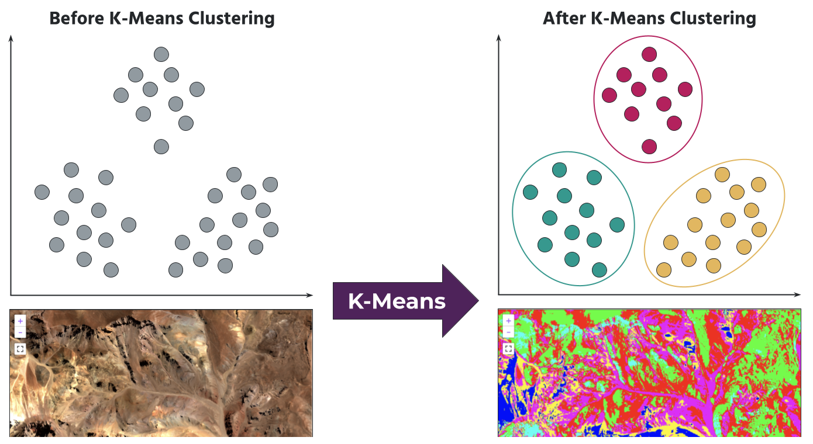

# K-Means Visualizer

Watch K-Means sort 600 photos into trips, one step at a time.

**Try it:** https://georgielovejuice.github.io/k-means-visualizer/

## What is K-Means?

Image: [EarthDaily](https://earthdaily.com/blog/get-to-know-marigold-part-4-complex-masking-k-means-clustering-classification)

You have a pile of photos from 3 trips, but nobody labeled them. K-Means sorts them by itself:

1. Drop 3 flags on the map.
2. Every photo joins its closest flag.
3. Each flag moves to the middle of its team.
4. Repeat until the flags stop moving.

That's it. No labels needed.

## Where is it used in real life?

- **Shopping apps** group customers by what they buy, so each group sees different deals.
- **Food delivery** picks where to build kitchens or hubs: the flags are the hubs, the photos are the orders.
- **Photo apps** group your pictures by place, like the "Trips" albums on your phone.
- **Satellite maps** group pixels into land types like rock, sand and water (bottom of the picture above).
- **Image compression** shrinks a picture to a few colors by grouping similar pixels.
- **Music apps** group songs that sound alike to build playlists.

## How to play

Press **Step line** to run one line of code, or **Play** to watch it go. Draw your own photos on the map and see what happens.

## Team

Group LarbUbon, CEi KMITL

Harris Suteerapornchai, Chanathip Jesdapairote, Supanut Chomthong, Thanakorn Sa-Nguannam, Paphada Borisutsukkamol

Inspired by [@machinelearningtogo](https://www.tiktok.com/@machinelearningtogo/video/7691252907978624288)
