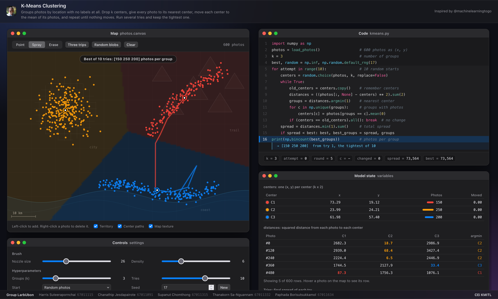

# K-Means Visualizer

A one-page tool that shows how K-Means clustering works, one line of Python at a time. Made for the Data Analysis class at CEi KMITL.

Live site: https://georgielovejuice.github.io/k-means-visualizer/



## What is K-Means?

Imagine 600 photos from 3 trips: a city, a coast and a mountain trail. Nobody wrote down which trip each photo belongs to. Each photo only has a place on the map, an (x, y) point. Can the computer sort them into trips anyway? K-Means does this.

1. Pick k. Here k = 3, so we want 3 groups.
2. Drop k flags (the centers) on random photos.
3. Every photo joins the team of its closest flag.
4. Move each flag to the middle of its team.
5. Repeat steps 3 and 4 until no flag moves.

Photos taken in the same place sit close together, so each flag ends up in the middle of one trip.

### The math, gently

**Closest** means the smallest squared distance. For a photo at (x1, y1) and a flag at (x2, y2):

```
(x1 - x2)^2 + (y1 - y2)^2
```

Example: photo (1, 2), flag (4, 6).
`(1 - 4)^2 + (2 - 6)^2 = 9 + 16 = 25`.
We skip the square root because the closest flag stays the closest flag without it.

**The middle** of a team is the mean: add the numbers up and divide by how many there are. A team has three photos with x = 2, 4 and 9. The flag's new x is `(2 + 4 + 9) / 3 = 5`. Do the same for y.

### Why play several tries?

The first flags are random, and a bad start can get stuck. For example, two flags may land in the city and split it in two, while the coast and the mountains share one flag.

So we play the whole game several times. Each try gets a score called WCSS (within-cluster sum of squares): for every photo, take the squared distance to its flag, then add them all up. A small score means tight teams. We keep the try with the smallest score.

There is also a **K-Means++** start. It still picks the first flag at random, but it prefers photos far from the flags already placed, so the flags start spread out.

## How to use the page

**Map** (top left)
- Point, Spray, Erase: choose how you add or remove photos. Left-click adds. Right-click on a photo deletes it. Nozzle size and Density set the spray.
- Three trips, Random blobs, Clear: load 600 photos from the three trips, load random blobs, or empty the map.
- Territory, Center paths, Map texture: tick boxes to show or hide the colored areas, the paths the flags took, and the background map.

**Controls** (bottom left)
- k: number of groups (2 to 8).
- Tries: how many times to play the whole game (1 to 15, default 10).
- Start: Random photos or K-Means++.
- Seed: number for the random choices. The same seed gives the same run.
- Speed (ms/line): how fast Play runs.
- Step line: run one line of Python. Shortcut: Space.
- Step round: run one full round (measure, join teams, move flags).
- Play until convergence: keep going until nothing moves. Shortcut: Enter (press again to pause).
- Run all tries: finish every try and show the best one.
- Reset: start over with the same photos.

**Panels on the right**
- Code: `kmeans.py` with the current line highlighted and a short note under it with the real numbers.
- Model state: the centers table, the distances table, and the Tries bars (one bar per try, green is the best).
- Loss: WCSS after each round, drawn as a line chart.

Try the default seed 17 with Three trips. One of the tries gets stuck, and the page discards it at the "keep the best" line.

## The Python code

This is the code the page steps through (`kmeans.py`):

```python
import numpy as np

# photos: array of shape (N, 2) containing the (x, y) coordinates of the photos.
# k: number of groups to form.
photos = load_photos()
k = 3

best, random = np.inf, np.random.default_rng(17)
for attempt in range(10):
    centers = random.choice(photos, k, replace=False)  # drop 3 flags on random photos
    while True:
        old_centers = centers.copy()
        distances = ((photos[:, None] - centers) ** 2).sum(2)  # measure how far each photo is from each flag
        groups = distances.argmin(1)  # each photo joins its closest flag
        for c in np.unique(groups):
            centers[c] = photos[groups == c].mean(0)  # move each flag to the middle of its team
        if (centers == old_centers).all():
            break  # nothing moved, so stop
    spread = distances.min(1).sum()  # score this game
    if spread < best:
        best, best_groups = spread, groups  # keep it if it's the best game so far
print(np.bincount(best_groups))
```

| Code | Plain meaning |
|---|---|
| `photos = load_photos()` | The (x, y) place of every photo. |
| `k = 3` | We want 3 groups. |
| `best, random = np.inf, ...default_rng(17)` | `best` starts as infinity so any score beats it. 17 is the seed. |
| `for attempt in range(10)` | Play the game 10 times. |
| `centers = random.choice(...)` | Drop k flags on k different random photos. |
| `while True:` | Repeat the next steps until we break out. |
| `old_centers = centers.copy()` | Remember where the flags were. |
| `distances = ((photos[:, None] - centers) ** 2).sum(2)` | Squared distance from every photo to every flag. One row per photo, one column per flag. |
| `groups = distances.argmin(1)` | In each row, find the smallest number. That flag is the photo's team. |
| `for c in np.unique(groups)` | Go through each flag that has at least one photo. |
| `centers[c] = photos[groups == c].mean(0)` | Move flag c to the mean of its team. |
| `if (centers == old_centers).all(): break` | If no flag moved, stop. |
| `spread = distances.min(1).sum()` | WCSS: add up each photo's squared distance to its own flag. |
| `if spread < best: ...` | If this try beats the best so far, keep it. |
| `print(np.bincount(best_groups))` | Print how many photos are in each group. |

The page runs this same logic in JavaScript.

## Files

- `index.html`: the real app. HTML, CSS and JavaScript in one file, as the assignment requires.
- `disassemble/`: the same app split into `index.html`, `style.css` and `js/1-setup.js` to `js/10-start.js`, so it is easier to read. Start with `js/4-kmeans.js`.
- `kmeans.py`: the Python above.
- `photos/screenshot.png`: the screenshot in this README.

## Run it locally

Open `index.html` in a browser. Or serve the folder:

```bash
python3 -m http.server 8080
```

Then go to http://localhost:8080.

## Team

Group LarbUbon, CEi KMITL.

| Name | Student ID |
|---|---|
| Harris Suteerapornchai | 67011115 |
| Chanathip Jesdapairote | 67011091 |
| Supanut Chomthong | 67011315 |
| Thanakorn Sa-Nguannam | 67011332 |
| Paphada Borisutsukkamol | 67011634 |

Inspired by the TikTok series by [@machinelearningtogo](https://www.tiktok.com/@machinelearningtogo/video/7691252907978624288).
